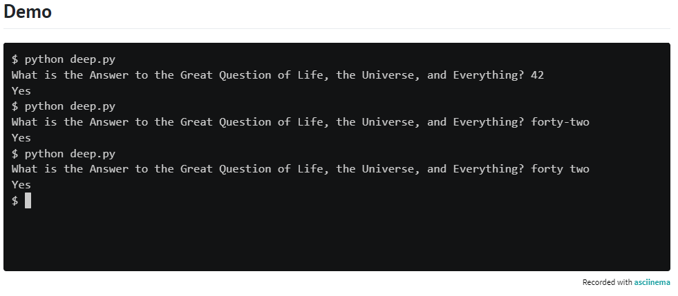

# Lesson plan for Deep Thought
  
  ** ** 
“All right,” said the computer, and settled into silence again. The two men fidgeted. The tension was unbearable.
“You’re really not going to like it,” observed Deep Thought.
“Tell us!”
“All right,” said Deep Thought. “The Answer to the Great Question…”
“Yes…!”
“Of Life, the Universe and Everything…” said Deep Thought.
“Yes…!”
“Is…” said Deep Thought, and paused.
“Yes…!”
“Is…”
“Yes…!!!…?”
“Forty-two,” said Deep Thought, with infinite majesty and calm.”

— The Hitchhiker’s Guide to the Galaxy, Douglas Adams

** **
In main.py, implement a program that prompts the user for the answer to the Great Question of Life, the Universe and Everything, outputting Yes if the user inputs 42 or (case-insensitively) forty-two or forty two. Otherwise output No.

  ## Hints
  1. No need to convert the user’s input to an int if you check for equality with "42", a str, rather than 42, an int!
  2. It’s okay if your output or the user’s wraps onto multiple lines.
     
## Demo
  

## How to test

Here’s how to test your code manually:
1. Run your program with python main.py. Type 42 and press Enter. Your program should output:
   Yes.
2. Run your program with python deep.py. Type Forty Two and press Enter. Your program should output:
    Yes.
3. Run your program with python deep.py. Type forty-two and press Enter. Your program should output
   Yes.
4. Run your program with python deep.py. Type 50 and press Enter. Your program should output :
   No.

Be sure to vary the casing of your input and “accidentally” add spaces on either side of your input before pressing enter. Your program should behave as expected, case- and space-insensitively.

