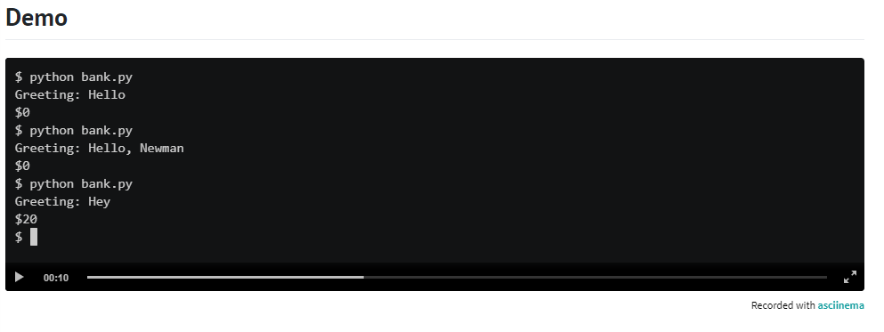
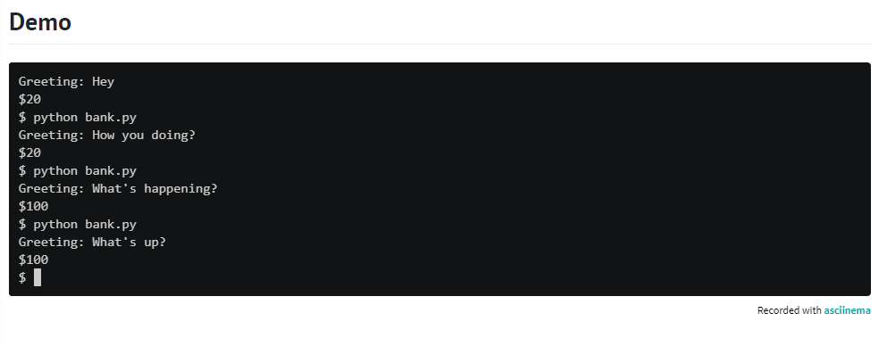
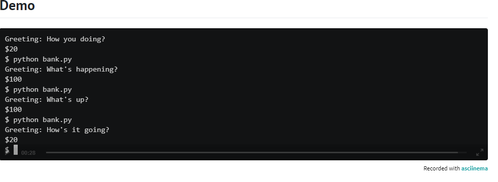
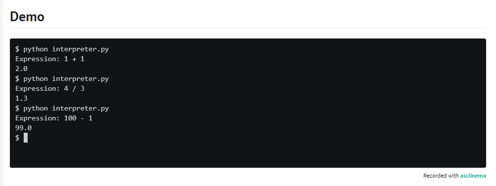
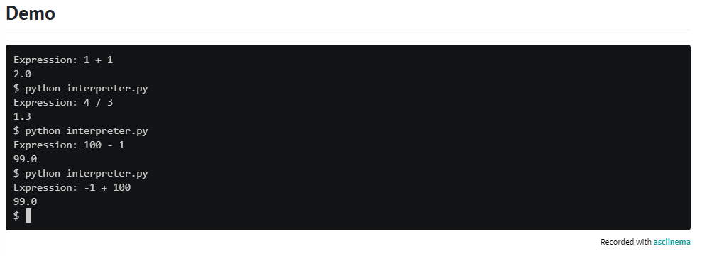
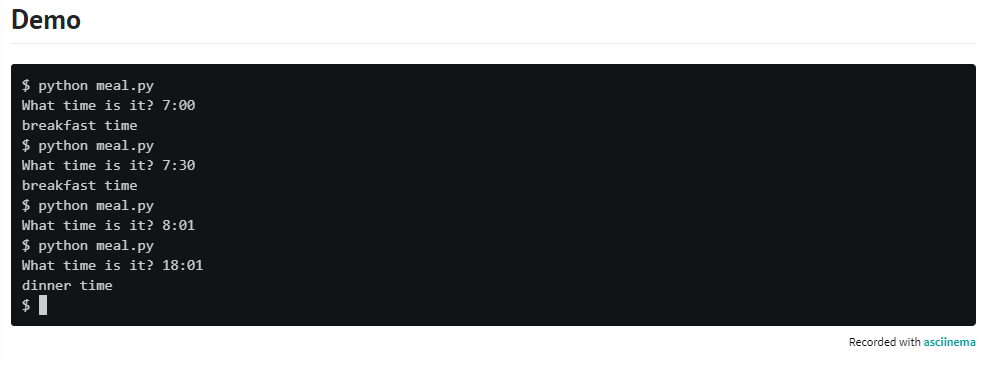
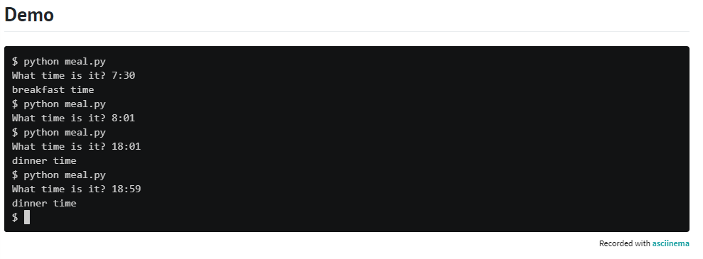
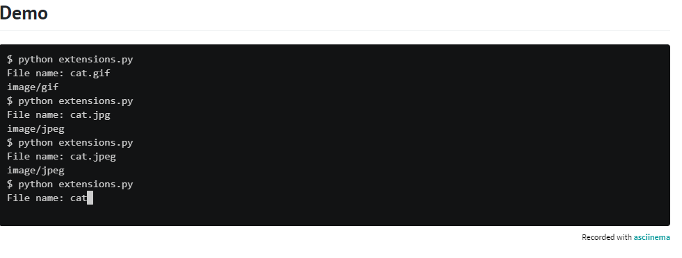

# Lesson plan for Deep Thought
  
  ** ** 
“All right,” said the computer, and settled into silence again. The two men fidgeted. The tension was unbearable.
“You’re really not going to like it,” observed Deep Thought.
“Tell us!”
“All right,” said Deep Thought. “The Answer to the Great Question…”
“Yes…!”
“Of Life, the Universe and Everything…” said Deep Thought.
“Yes…!”
“Is…” said Deep Thought, and paused.
“Yes…!”
“Is…”
“Yes…!!!…?”
“Forty-two,” said Deep Thought, with infinite majesty and calm.”

— The Hitchhiker’s Guide to the Galaxy, Douglas Adams

** **
In main.py, implement a program that prompts the user for the answer to the Great Question of Life, the Universe and Everything, outputting Yes if the user inputs 42 or (case-insensitively) forty-two or forty two. Otherwise output No.

  ## Hints
  1. No need to convert the user’s input to an int if you check for equality with "42", a str, rather than 42, an int!
  2. It’s okay if your output or the user’s wraps onto multiple lines.
     
## Demo
  

## How to test

Here’s how to test your code manually:
1. Run your program with python main.py. Type 42 and press Enter. Your program should output:
   Yes.
2. Run your program with python deep.py. Type Forty Two and press Enter. Your program should output:
    Yes.
3. Run your program with python deep.py. Type forty-two and press Enter. Your program should output
   Yes.
4. Run your program with python deep.py. Type 50 and press Enter. Your program should output :
   No.

Be sure to vary the casing of your input and “accidentally” add spaces on either side of your input before pressing enter. Your program should behave as expected, case- and space-insensitively.

# Lesson Plan Home Federal Savings Bank

## Links 
[link](https://www.youtube.com/watch?v=IN6cJ_wGmsk)

In season 7, episode 24 of Seinfeld, Kramer visits a bank that promises to give $100 to anyone who isn’t greeted with a “hello.” Kramer is instead greeted with a “hey,” which he insists isn’t a “hello,” and so he asks for $100. The bank’s manager proposes a compromise: “You got a greeting that starts with an ‘h,’ how does $20 sound?” Kramer accepts.

In a file called bank.py, implement a program that prompts the user for a greeting. If the greeting starts with “hello”, output $0. If the greeting starts with an “h” (but not “hello”), output $20. Otherwise, output $100. Ignore any leading whitespace in the user’s greeting, and treat the user’s greeting case-insensitively.

## Hints 
1. Recall that a str comes with quite a few methods, per docs.python.org/3/library/stdtypes.html#string-methods.
2. Be sure to give $0 not only for “hello” but also “hello there”, “hello, Newman”, and the like.

## Demo

  
  
  

  
  

## How to Test

Here’s how to test your code manually:

  1. Run your program with python bank.py. Type Hello and press Enter. Your program should output:
     $0
  2. Run your program with python bank.py. Type Hello, Newman and press Enter. Your program should output:
     $0
  3. Run your program with python bank.py. Type How you doing? and press Enter. Your program should output
     $20
  4. Run your program with python bank.py. Type What's happening? and press Enter. Your program should output
     $100

# Lesson Plan Math Interpreter

Python already supports math, whereby you can write code to add, subtract, multiply, or divide values and even variables. But let’s write a program that enables users to do math, even without knowing Python.

In a file called interpreter.py, implement a program that prompts the user for an arithmetic expression and then calculates and outputs the result as a floating-point value formatted to one decimal place. Assume that the user’s input will be formatted as x y z, with one space between x and y and one space between y and z, wherein:

* x is an integer
* y is +, -, *, or /
* z is an integer
For instance, if the user inputs 1 + 1, your program should output 2.0. Assume that, if y is /, then z will not be 0.

Note that, just as python itself is an interpreter for Python, so will your interpreter.py be an interpreter for math!

## Hints
Recall that a str comes with quite a few methods, per docs.python.org/3/library/stdtypes.html#string-methods, including split, which separates a str into a sequence of values, all of which can be assigned to variables at once. For instance, if expression is a str like 1 + 1, then

x, y, z = expression.split(" ")

will assign 1 to x, + to y, and 1 to z.

## Demo

  
  
  
  
## How to test 
Here’s how to test your code manually:
* Run your program with python interpreter.py. Type 1 + 1 and press Enter. Your program should output:
  2.0
* Run your program with python interpreter.py. Type 2 - 3 and press Enter. Your program should output:
  -1.0
* Run your program with python interpreter.py. Type 2 * 2 and press Enter. Your program should output
  4.0
* Run your program with python interpreter.py. Type 50 / 5 and press Enter. Your program should output
  10.0

# Lesson plan for Meal Time
Suppose that you’re in a country where it’s customary to eat breakfast between 7:00 and 8:00, lunch between 12:00 and 13:00, and dinner between 18:00 and 19:00. Wouldn’t it be nice if you had a program that could tell you what to eat when?

In meal.py, implement a program that prompts the user for a time and outputs whether it’s breakfast time, lunch time, or dinner time. If it’s not time for a meal, don’t output anything at all. Assume that the user’s input will be formatted in 24-hour time as #:## or ##:##. And assume that each meal’s time range is inclusive. For instance, whether it’s 7:00, 7:01, 7:59, or 8:00, or anytime in between, it’s time for breakfast.

Structure your program per the below, wherein convert is a function (that can be called by main) that converts time, a str in 24-hour format, to the corresponding number of hours as a float. For instance, given a time like "7:30" (i.e., 7 hours and 30 minutes), convert should return 7.5 (i.e., 7.5 hours).

def main():
    ...

def convert(time):
    ...

if __name__ == "__main__":
    main()

## Hints
* Recall that a str comes with quite a few methods, per docs.python.org/3/library/stdtypes.html#string-methods, including split, which  
  separates a str into a sequence of values, all of which can be assigned to variables at once. For instance, if time is a str like 
  "7:30", then
       hours, minutes = time.split(":")
  will assign "7" to hours and "30" to minutes.
* Keep in mind that there are 60 minutes in 1 hour.

## Demo
    
    
    

## Challenge
If up for a challenge, optionally add support for 12-hour times, allowing the user to input times in these formats too:

* #:## a.m. and ##:## a.m.
* #:## p.m. and ##:## p.m.

## How to Test

Here’s how to test your code manually:

* Run your program with python meal.py. Type 7:00 and press Enter. Your program should output:
  breakfast time   
* Run your program with python meal.py. Type 7:30 and press Enter. Your program should output:
  breakfast time
* Run your program with python meal.py. Type 12:42 and press Enter. Your program should output
  lunch time
* Run your program with python meal.py. Type 18:32 and press Enter. Your program should output
  dinner time
* Run your program with python meal.py. Type 11:11 and press Enter. Your program should output nothing.

# Lesson Plan for File Extensions

Even though Windows and macOS sometimes hide them, most files have file extensions, a suffix that starts with a period (.) at the end of their name. For instance, file names for GIFs end with .gif, and file names for JPEGs end with .jpg or .jpeg. When you double-click on a file to open it, your computer uses its file extension to determine which program to launch.

Web browsers, by contrast, rely on media types, formerly known as MIME types, to determine how to display files that live on the web. When you download a file from a web server, that server sends an HTTP header, along with the file itself, indicating the file’s media type. For instance, the media type for a GIF is image/gif, and the media type for a JPEG is image/jpeg. To determine the media type for a file, a web server typically looks at the file’s extension, mapping one to the other.

See developer.mozilla.org/en-US/docs/Web/HTTP/Basics_of_HTTP/MIME_types/Common_types for common types.

In a file called extensions.py, implement a program that prompts the user for the name of a file and then outputs that file’s media type if the file’s name ends, case-insensitively, in any of these suffixes:

* .gif
* .jpg
* .jpeg
* .png
* .pdf
* .txt
* .zip

If the file’s name ends with some other suffix or has no suffix at all, output application/octet-stream instead, which is a common default.

## Hints
* Recall that a str comes with quite a few methods, per docs.python.org/3/library/stdtypes.html#string-methods.

## Demo

   
   

## How to test

Here’s how to test your code manually:

* Run your program with python extensions.py. Type happy.jpg and press Enter. Your program should output:
  image/jpeg  
* Run your program with python extensions.py. Type document.pdf and press Enter. Your program should output:
  image/jpeg  
Be sure to test each of the other file formats, vary the casing of your input, and “accidentally” add spaces on either side of your input before pressing enter. Your program should behave as expected, case- and space-insensitively.

